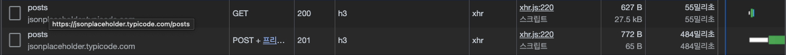
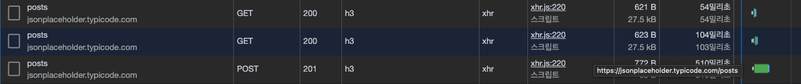
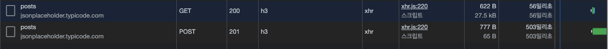

## 🖐 궁금증 7 : invalidateQueries 메소드로 여러 쿼리 stale하게 만들기

마지막에 3줄 요약을 달아 두었습니다. 정보만이 필요하시다면 3줄 요약을 확인해주시고, 개요와 고민 결론의 이르는 모든 과정이 궁금하시다면 쭉 읽어 주십쇼!!

## 개요

다음은 우리의 `useMutation` 기반의 커스텀 훅이다. 프로덕트를 개발하다보니 다음 코드와 같이 여러 개의 쿼리를 `invalidation` 해준 후 재검증 해줄 필요가 생겼다. 최초 코드는 아래와 같다.

```jsx
const QUERY_KEY = {
  /** MAIN KEY */
  coupon: "coupon",
  reservationList: "reservationList",
  couponList: "couponList",
  couponListByStatus: "couponListByStatus",

  /** SUB KEY */
  sent: "sent",
  received: "received",
};

export const useChangeCouponStatusMutation = (id: number) => {
  const queryClient = useQueryClient();
  const { coupon } = useFetchCoupon(id);
  const { me } = useFetchMe();
  const { showLoading, hideLoading } = useLoading();

  return useMutation(changeCouponStatus, {
    onSuccess() {
      const isSent = coupon?.sender.id === me?.id;

      queryClient.invalidateQueries([QUERY_KEY.coupon, id]);

      if (isSent) {
        queryClient.invalidateQueries([QUERY_KEY.reservationList]);
        queryClient.invalidateQueries([QUERY_KEY.couponList, QUERY_KEY.sent]);
        queryClient.invalidateQueries([
          QUERY_KEY.couponListByStatus,
          QUERY_KEY.sent,
        ]);

        return;
      }

      queryClient.invalidateQueries([QUERY_KEY.reservationList]);
      queryClient.invalidateQueries([QUERY_KEY.couponList, QUERY_KEY.received]);
      queryClient.invalidateQueries([
        QUERY_KEY.couponListByStatus,
        QUERY_KEY.received,
      ]);
    },
    onMutate() {
      showLoading();
    },
    onSettled() {
      hideLoading();
    },
  });
};
```

위와 같이 `invalidateQueries`를 각 쿼리별로 호출하고 있다. 이렇게 작성하다보면 다음과 같은 문제상황이 발생할 수 있다.

- 쿼리 키가 바뀌는 경우 두 곳을 수정해주어야 한다.

`invalidateQueries`는 여러 개의 쿼리를 갱신할 수 있다고 한다. 그렇기 때문에 최초 코드와 같은 상황을 방지하고자 탐구 후 프로젝트의 코드를 리팩터링 하고자 한다.

## 탐구와 정리

단일 쿼리 키를 `refetch`하는 방법은 아래와 같다.

```jsx
queryClient.invalidateQueries([QUERY_KEY.reservationList]);
```

직접 한번 쿼리를 `stale` 하게 만들어 재검증해보자. 다음은 `PostContainer` 컴포넌트이며, button을 클릭하면 `createPost` 동작을 수행하고, `posts` 키의 쿼리를 `stale`하게 만든 후 갱신한다.

```jsx
// @components/post/PostContainer.js

const PostContainer = () => {
  const { posts } = useFetchPostList();

  const { createPost } = useCreatePost();

  const queryClient = useQueryClient();

  const onClickCreatePostButton = () => {
    const body = JSON.stringify({
      title: "foo",
      body: "bar",
      userId: 1,
    });

    const result = createPost(body);

    queryClient.invalidateQueries("posts");
  };

  return (
    <div>
      <button onClick={onClickCreatePostButton}>Post 생성하기</button>
      <PostList posts={posts}></PostList>
      <PostList posts={postsSecond}></PostList>
    </div>
  );
};
```

☺️**여기서 잠깐** Stale 해지면, 활성 쿼리의 경우 재검증을 시도한다. 플로우는 다음과 같다. (구식이 된다) -> (구식의 데이터로 렌더링) -> 재검증(refetch) -> (갱신된 데이터로 캐시 데이터를 갈아 끼우고 렌더링)

결과는 다음과 같다.



그럼 프로젝트의 상황과 동일하게 여러개의 쿼리를 갱신해야한다면 어떻게 해야할까? 프로젝트와 동일한 방식으로 쿼리를 갱신해볼 수 있다. 다음과 같이 말이다.

```jsx
const PostContainer = () => {
  const { posts } = useFetchPostList();
  const { posts: postsSecond } = useFetchPostListSecond();

  const { createPost } = useCreatePost();

  const queryClient = useQueryClient();

  const onClickCreatePostButton = () => {
    const body = JSON.stringify({
      title: "foo",
      body: "bar",
      userId: 1,
    });

    const result = createPost(body);

    // 여러 개의 쿼리를 갱신한다.

    queryClient.invalidateQueries("posts");
    queryClient.invalidateQueries("postsSecond");
  };

  return (
    <div>
      <button onClick={onClickCreatePostButton}>Post 생성하기</button>
      <PostList posts={posts}></PostList>
      <PostList posts={postsSecond}></PostList>
    </div>
  );
};
```

위와 같이 작성하면 결과는 다음과 같다. `POST` 요청을 하게되면 'posts' 'postsSecond' 키의 쿼리가 `stale` 해지고 활성 쿼리이기에 `revalidation` 한다.



그렇담 문제를 해결해보자. `invalidateQueries`에서 여러개의 쿼리를 한 번에 갱신하는 것이 우리의 문제 해결 목표였다. 다음과 같이 작성해보면 어떨까 ?

```jsx
const onClickCreatePostButton = () => {
  const body = JSON.stringify({
    title: "foo",
    body: "bar",
    userId: 1,
  });

  const result = createPost(body);

  // 한 번의 invalidateQueries로 여러 개의 쿼리를 갱신할 수 있는지 테스트

  queryClient.invalidateQueries("posts");
};
```

결과는 아래와 같이 두 번째 쿼리는 갱신되지 않는 것을 확인할 수 있었다.



그렇다면 결국 인자로 넣는 문자열이 일치할 때만 해당 쿼리 키가 `stale`해지고 `revalidation`이 된다는 것. 문자열로 키가 관리될 때는 조금은 정리가 되었다. 인자로 넣는 문자열의 값이 일치하는 쿼리만 구식이되고 재검증 요청의 대상이 된다는 것! 그렇다면 프로젝트 상황과 동일하게 쿼리의 키가 배열로 관리되고 있을 때는 어떠할까?

### 그들이 말하길

[Query invalidation](https://tanstack.com/query/v4/docs/guides/query-invalidation)

1. 모든 키의 쿼리가 구식이되고 재검증 요청의 대상이 된다.

```jsx
// 캐시 안의 모든 쿼리가 구식이되고 재검증 요청의 대상이 된다.
queryClient.invalidateQueries();
```

2. 특정 문자열 서브키를 포함하는 경우에만 구식이되고 재검증 요청의 대상이된다.

```jsx
// 키 배열의 첫 번째 원소가 'todos'라면 구식이 되고 재검증 요청의 대상이된다.
queryClient.invalidateQueries(["todos"]);

// 키 배열의 첫 번째 원소가 'todos' 이면서 두 번째 원소가 {type:'done'} 의 객체여야함. 나머지 경우는 안된다.
queryClient.invalidateQueries(["todos", { type: "done" }]);
```

3. 정확히 일치하는 경우에만 구식이되고 재검증 요청의 대상이 된다.

```jsx
queryClient.invalidateQueries(["todos"], { exact: true });
```

쿼리 키를 배열로 관리할 때 생각해볼 수 있는 시나리오는 위 세 개인 것 같다. 그럼 이제 선택할 차례이다.

## 팀의 선택

문서를 읽고 분석해본 현재 방식을 정리하자면 아래와 같다. (주석을 보라)

```jsx
 onSuccess() {
      const isSent = coupon?.sender.id === me?.id;

      // 첫 번째 원소가 QUERYKEY.coupon 이면서 두 번째 원소가 id 값이기만 하면 구식이 된다.
      queryClient.invalidateQueries([QUERY_KEY.coupon, id]);

      if (isSent) {
        // 첫 번째 원소가 QUERY_KEY.reservationList와 같다면 구식이 된다.
        queryClient.invalidateQueries([QUERY_KEY.reservationList]);
        // 첫 번째 원소, 두 번째 원소가 QUERY_KEY.couponList, QUERY_KEY.sent와 같다면 구식이 된다.
        queryClient.invalidateQueries([QUERY_KEY.couponList, QUERY_KEY.sent]);
        // 첫 번째 원소, 두 번째 원소가  QUERY_KEY.couponListByStatus, QUERY_KEY.sent,와 같다면 구식이 된다.
        queryClient.invalidateQueries([
          QUERY_KEY.couponListByStatus,
          QUERY_KEY.sent,
        ]);

        return;
      }

      // if 문의 상황과 동일하다.
      queryClient.invalidateQueries([QUERY_KEY.reservationList]);
      queryClient.invalidateQueries([QUERY_KEY.couponList, QUERY_KEY.received]);
      queryClient.invalidateQueries([
        QUERY_KEY.couponListByStatus,
        QUERY_KEY.received,
      ]);
    },
```

그렇다면 현재 방식에서 문제가 될 수 있는 부분이 늘어났다.

1. 중복으로 인해 유지보수가 힘들어졌다. (기존 문제)
2. **쿼리 키 배열을 포함하는 배열의 쿼리라면 의도하지 않았어도 구식이 된다.**

### 1번 문제 해결하기

1번 문제를 해결하기 위해선 QUERY_KEY 객체의 값을 바꿀 핋요가 있다. 현재 쿼리 키 상황이라면 coupon과 reservationList의 쿼리 데이터를 구식으로 만들고 싶을 때 두 번의 메소드 호출이 필요하다.

TO BE

```jsx
const QUERY_KEY = {
  /** MAIN KEY */
  coupon: "coupon",
  reservationList: "reservationList",
  couponList: "couponList",
  couponListByStatus: "couponListByStatus",

  /** SUB KEY */
  sent: "sent",
  received: "received",
};

export const useFetchCoupon = (id: number) => {
  const { data } = useQuery([QUERY_KEY.coupon, id], () => getCoupon(id), {
    staleTime: 10000,
  });

  return {
    coupon: data,
  };
};

export const useFetchReservationList = () => {
  const { data, isLoading } = useQuery(
    [QUERY_KEY.reservationList],
    () => getReservationList(),
    {
      staleTime: 10000,
    }
  );

  return {
    reservationList: data?.data ?? [],
    isLoading,
  };
};
```

만약 한 번의 `invalidateQueries`의 호출로 두 쿼리가 같이 갱신되게 구현하고 싶다면 두개의 **쿼리 키 배열**의 상황과 **쿼리 키 상수 값**을 수정해줄 필요가 있다. 예를 들자면 아래와 같이 해볼 수 있다.

AS IS

```jsx
export const useFetchCoupon = (id: number) => {
  // invalidateQueries([QUERY_KEY.coupon])를 호출하게 되면 구식이 된다!!
  const { data } = useQuery([QUERY_KEY.coupon, id], () => getCoupon(id), {
    staleTime: 10000,
  });

  return {
    coupon: data,
  };
};

export const useFetchReservationList = () => {
  // invalidateQueries([QUERY_KEY.coupon])를 호출하게 되면 구식이 된다!!
  const { data, isLoading } = useQuery(
    [QUERY_KEY.coupon, QUERY_KEY.reservationList],
    () => getReservationList(),
    {
      staleTime: 10000,
    }
  );

  return {
    reservationList: data?.data ?? [],
    isLoading,
  };
};
```

`invalidateQueries` 한 번의 호출로도 두 개의 쿼리를 구식으로 만들 수 있다.

### 2번 문제 해결하기

두 번째 문제 였던 <**쿼리 키 배열을 포함하는 배열의 쿼리라면 의도하지 않았어도 구식이 된다.**>는 확실히 치명적이다. 우리가 의도하지 않음에도 구식이 된다면 `refetch` 동작이 발생할 수 있으므로, 불필요한 네트워크 요청의 횟수가 생길 수 있다.

따라서 다음과 같이 프로덕션 코드를 수정한다면 정확히 우리가 의도한대로만 동작할 수 있다.

```jsx
 onSuccess() {
      const isSent = coupon?.sender.id === me?.id;


      queryClient.invalidateQueries([QUERY_KEY.coupon, id],{exact : true});

      if (isSent) {
        queryClient.invalidateQueries([QUERY_KEY.reservationList],{exact : true});

        queryClient.invalidateQueries([QUERY_KEY.couponList, QUERY_KEY.sent],{exact : true});

        queryClient.invalidateQueries([
          QUERY_KEY.couponListByStatus,
          QUERY_KEY.sent,
        ],{exact : true});

        return;
      }
    /*...*/
    },
```

어떤 조건에서 `invalidateQueries`가 쿼리 데이터를 구식으로 만드는 지 알게되니 의도치 않는 동작을 방지할 수 있다!

## 얻은 점

- `invalidateQueries` 에 `exact : true` 옵션을 주면 정확히 키 배열과 일치하는 경우에만 쿼리데이터가 구식이 된다.(일치하는 : 배열의 원소 구성이 같고, 그 값이 같은 경우)

- `invalidateQueries` 에 배열 키를 넣으면 원소 구성을 포함하는 형태의 쿼리 키 배열을 가진 쿼리 데이터가 구식이 된다. (의도치 않는 쿼리 데이터 구식 기능이 발생할 수 있다.)

- `invalidateQueries` 에 원시 값을 넣으면 정확히 일치하는 쿼리의 경우에만 구식이 된다.

## 앞으로 정리해볼 것

쿼리 키를 객체로 관리하는 상황이라면 ?
